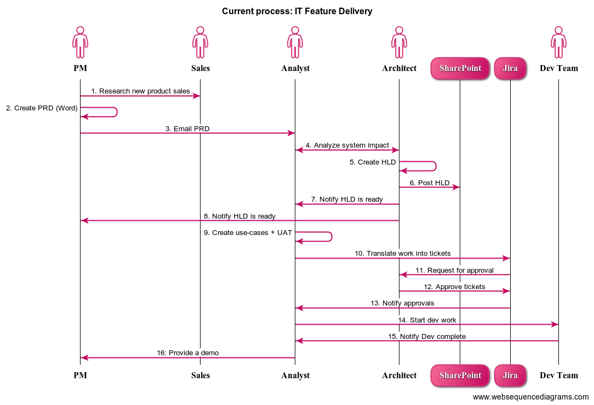
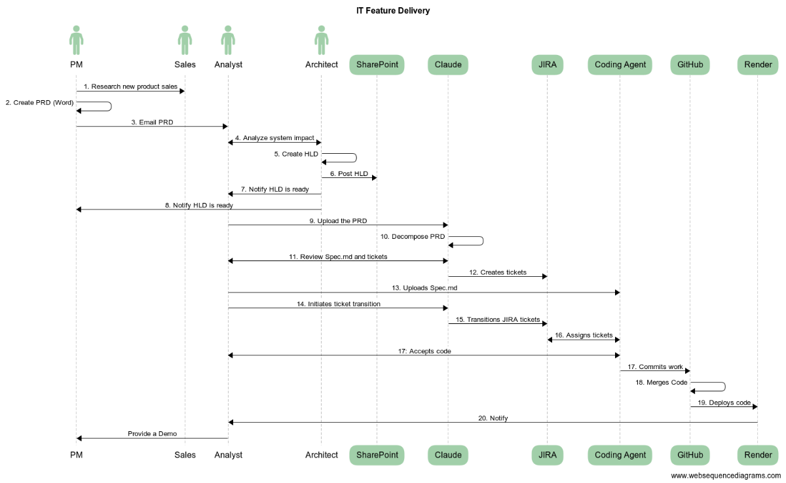

# AI-Powered IT Feature Delivery Pipeline

An end-to-end autonomous SDLC pipeline that takes any IT requirement — from a one-line enhancement request to a full PRD — and delivers production-deployed code. Replaces a 16-step manual process with a single human trigger.

## Pipeline Architecture

### Before (Manual — 16 Steps)


### After (AI-Automated)


---

## What Can Be Ingested

The pipeline is not limited to PRDs. Any structured requirement can be the entry point:

| Input Type | Example | Output |
|---|---|---|
| **Product Requirements Doc (PRD)** | New feature spec with user stories, personas, KPIs | Epic → multiple Stories → full feature branch |
| **IT System Enhancement** | "Add ACH AutoPay support to the checkout flow" | Single Story → targeted code change → deploy |
| **Bug Report** | "Order confirmation email not sending for smartwatch orders" | Bug ticket → fix → test → patch deploy |
| **POC / Spike** | "Evaluate feasibility of fraud score integration at order entry" | Spike ticket → prototype code → findings doc |
| **Technical Debt** | "Refactor eligibility logic into reusable service layer" | Tech debt story → refactor → regression tests |
| **Compliance / Policy Change** | "Flag NY State vulnerable customers in order flow" | Requirement → targeted implementation → audit trail |

The Claude AI decomposition layer adapts ticket scope, story count, and acceptance criteria depth based on the size and type of the input — a one-liner enhancement becomes a single Story; a full PRD becomes an Epic with 5–10 Stories.

---

## How It Works

```
Requirement Input (any format)
   │
   ▼
Claude AI — interprets requirement type + scope
   │         decomposes into appropriately-sized
   │         JIRA tickets with EARS acceptance criteria
   │
   ▼
Atlassian Rovo MCP — creates structured JIRA tickets
   │                  (Epic → Stories, or standalone Story/Bug/Spike)
   │
   ▼
WebStorm IDE — JIRA integration pulls ticket automatically
   │            Claude AI coding agent reads the spec
   │            implements the code (spec-driven development)
   │
   ▼
GitHub — code committed to feature branch
   │
   ▼
GitHub Actions — CI/CD pipeline (test → build → push)
   │
   ▼
Render — auto-deploy to production
```

---

## Human Touchpoints

Only **two** checkpoints in the entire pipeline:
1. Providing the requirement (any format)
2. Reviewing JIRA tickets before code generation begins

Everything else — decomposition, spec writing, ticket creation, coding, CI/CD, and deployment — runs autonomously.

---

## What Makes This Work

**The JIRA ticket IS the spec.**

All tickets are written in EARS format (Easy Approach to Requirements Syntax) with precise, testable acceptance criteria. When WebStorm's JIRA integration surfaces the ticket to the Claude AI coding agent, Claude has everything it needs to implement — no Slack threads, no handoff calls, no ambiguity.

The same pipeline works across scales because the decomposition layer adjusts to the input:
- A two-sentence enhancement → one well-scoped Story
- A multi-page PRD → a full Epic hierarchy with prioritized Stories

---

## Tech Stack

| Layer | Tool |
|---|---|
| Requirement Decomposition | Claude AI |
| JIRA Ticket Creation | Atlassian Rovo MCP |
| IDE + Coding Agent | WebStorm + Claude AI |
| Version Control | GitHub |
| CI/CD | GitHub Actions |
| Deployment | Render |

---

## Related Projects

- [MCP Chatbot](https://github.com/shuvojit0194-star/Chatbot) — a live project built end-to-end using this pipeline
- [Weather Feature SCRUM Specs](https://github.com/shuvojit0194-star/Weather_Feature_SCRUM) — example EARS-format ticket specs that feed the coding agent
